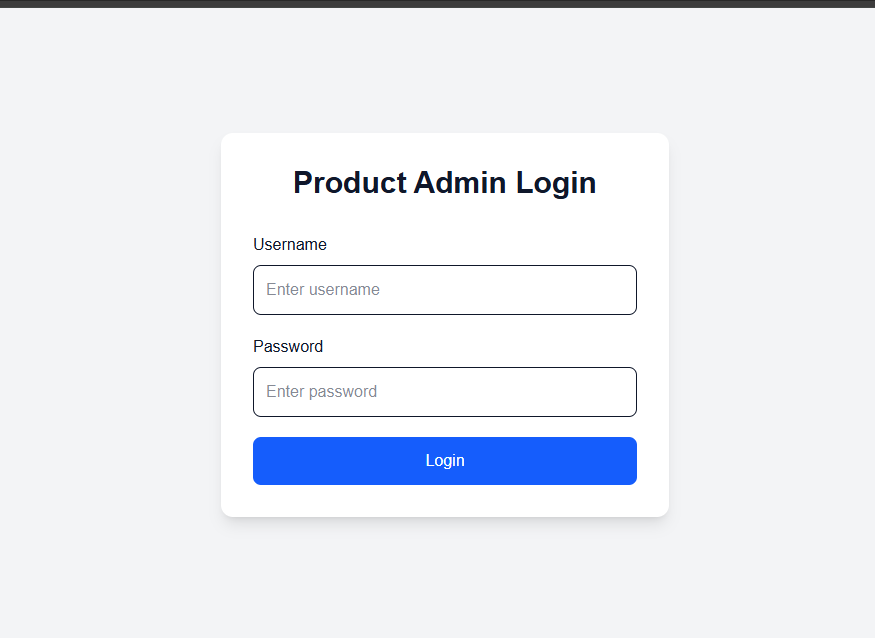
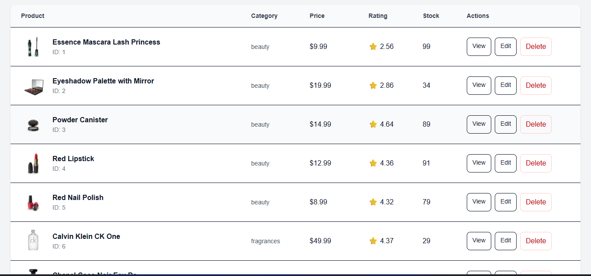
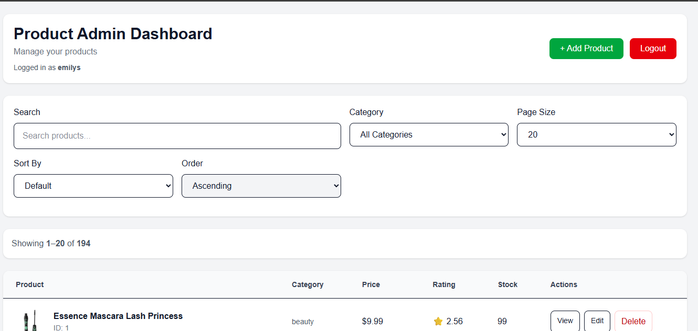
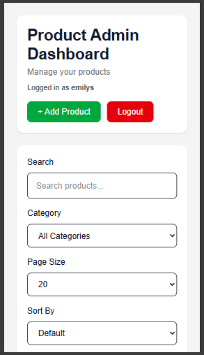
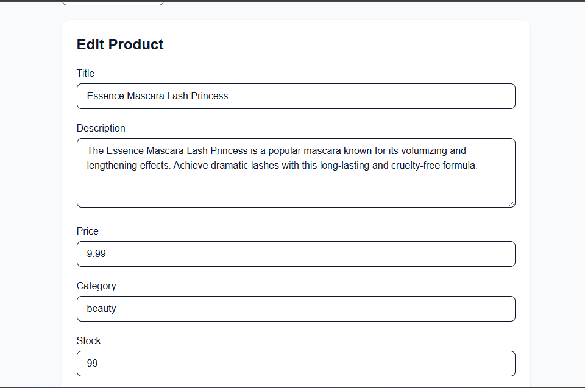

# Product Admin Dashboard

A responsive **Product Admin Dashboard** built with **Next.js, React, Tailwind CSS, Axios, and DummyJSON API**.

The application allows authenticated users to view, search, filter, sort, add, edit, delete, and inspect product details through a responsive dashboard interface.

---

## 📸 Screenshots

### Login



### Product Dashboard



### Desktop Product Table



### Mobile Product Cards



### Product Details


### Edit Product



### Search, Filter and Sorting


# 🚀 Features

## Authentication

* Login using DummyJSON authentication.
* Username:

```text
emilys
```

* Password:

```text
emilyspass
```

* Login token is stored locally.
* Axios automatically adds the token to API requests.
* Protected product pages.
* Logout functionality.
* Invalid login credentials display an error message.

---

## Product Management

The dashboard supports:

* View all products
* View product details
* Add products
* Edit products
* Delete products
* Product confirmation before deletion
* Loading states
* Empty states
* Error states
* Retry functionality


# 📄 Pagination

The dashboard supports:

* Previous button
* Next button
* Individual page numbers
* Page size selection
* 10 products per page
* 20 products per page
* 50 products per page


# 📱 Responsive Design

The application provides different layouts depending on screen size.

### Desktop

Products are displayed using a table containing:

* Product
* Category
* Price
* Rating
* Stock
* Actions

### Mobile

Products are displayed as responsive cards.

The application uses Tailwind CSS responsive utilities to switch between the layouts.


# 🛠️ Technology Stack

| Technology   | Purpose                        |
| ------------ | ------------------------------ |
| Next.js      | Frontend framework             |
| React        | UI development                 |
| Tailwind CSS | Styling and responsive design  |
| Axios        | API requests                   |
| DummyJSON    | Product and authentication API |
| JavaScript   | Application development        |

---

# 📁 Project Structure

```text
Product-Admin-Dashboard/
│
├── app/
│   ├
│   ├── globals.css
│   ├── layout.js
│   ├── page.js
│   │
│   ├── login/
│   │   └── page.js
│   │
│   └── products/
│       ├── page.js
│       │
│       ├── add/
│       │   └── page.js
│       │
│       └── [id]/
│           ├── page.js
│           ├── not-found.js
│           │
│           └── edit/
│               └── page.js
│
├── components/
│   ├── AuthProvider.js
│   ├── Protected.js
│   ├── ProductCard.js
│   ├── ProductTable.js
│   └── ProductForm.js
│
├── lib/
│   ├── api.js
│   ├── auth.js
│   └── axios.js
│
├── public/
│
├── screenshots/
│   ├── login.png
│   ├── products.png
│   ├── product-table.png
│   ├── mobile-products.png
│   ├── product-details.png
│   ├── add-product.png
│   ├── search-filter-sort.png
│   └── edit-product.png
│
├── .gitignore
├── eslint.config.mjs
├── jsconfig.json
├── next.config.mjs
├── package.json
├── package-lock.json
├── postcss.config.mjs
└── README.md
```

---

# 🔌 API

The application uses the DummyJSON API: 'https://dummyjson.com'


## Authentication

```text
POST /auth/login
```

## Products

```text
GET /products
```

## Search

```text
GET /products/search?q=
```

## Categories

```text
GET /products/categories
```

## Category Products

```text
GET /products/category/{category}
```

## Product Details

```text
GET /products/{id}
```

## Add Product

```text
POST /products/add
```

## Update Product

```text
PUT /products/{id}
```

## Delete Product

```text
DELETE /products/{id}
```

---

# 🔐 Axios Configuration

A shared Axios instance is used throughout the application.

The Axios instance is located at:

```text
lib/axios.js
```

It provides:

* Common API base URL
* Authorization token
* Centralized request configuration
* Centralized API error handling

The authentication token is automatically added to requests:

```text
Authorization: Bearer <token>
```

